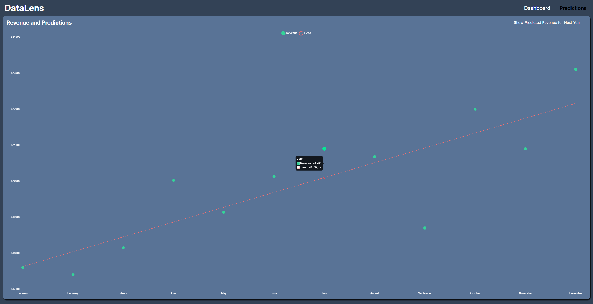
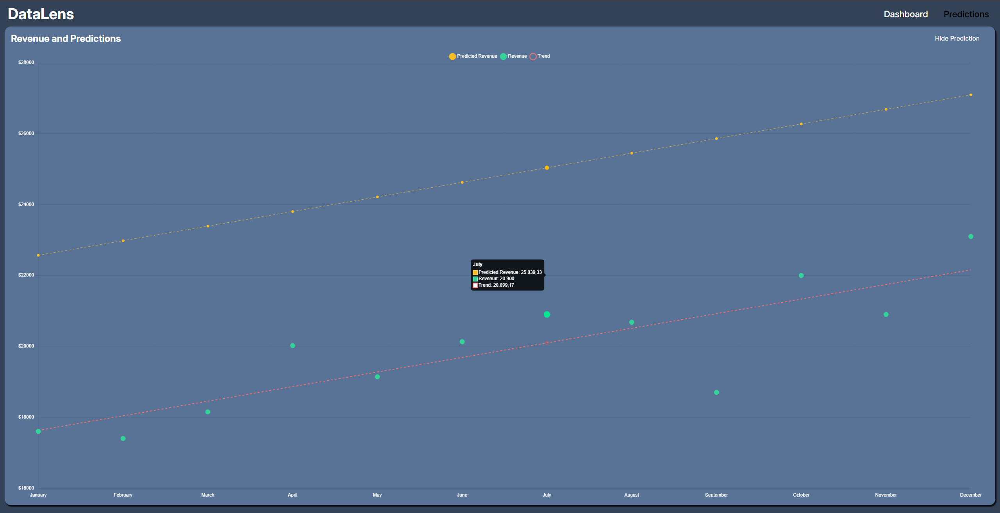

# DataLens
Dashboard finanziaria interattiva con elementi di Machine Learning per analisi predittive.

## Caratteristiche Principali

- **Analisi Predittiva**: Implementazione di regressione lineare per previsioni accurate dei ricavi futuri
- **Visualizzazioni Interattive**: Grafici dinamici per revenue, expenses, profit e trend mensili
- **Gestione Dati**: Sistema integrato per tracking ordini, analisi prodotti e breakdown delle spese

## Galleria

### Dashboard Principale
La dashboard principale offre una visione completa delle metriche finanziarie chiave:

*Visualizzazione di revenue, expenses, profit trends e analisi dei prodotti*

### Predictions
La sezione Predictions mostra il modello di regressione lineare applicato ai dati storici:

*Linea di trend (rossa) calcolata con regressione lineare sui dati storici (verdi)*

### Predictions con Forecast Futuro
Visualizzazione delle previsioni future basate sul modello:

*Previsioni revenue future (gialle) generate dal modello*

## Stack Tecnologico

- **Angular 19** - Framework moderno per webapp reattive
- **TypeScript** - Linguaggio type-safe utilizzato per lo sviluppo della webapp
- **Spring Boot** - Framework java per API RESTful
