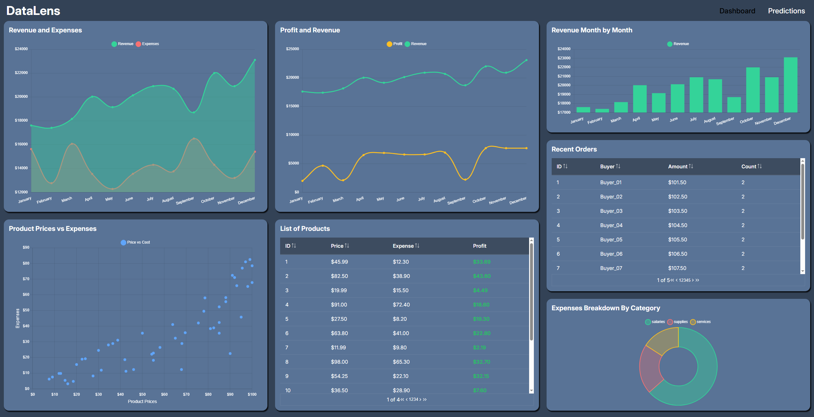

# DataLens
Dashboard finanziaria interattiva con elementi di Machine Learning ( Regressione Lineare ) per analisi predittive.

## Caratteristiche Principali

- **Analisi Predittiva**: Implementazione di regressione lineare per previsioni accurate dei ricavi futuri
- **Visualizzazioni Interattive**: Grafici dinamici per revenue, expenses, profit e trend mensili
- **Gestione Dati**: Sistema integrato per tracking ordini, analisi prodotti e breakdown delle spese

## Galleria

### Dashboard Principale
La dashboard principale offre una visione completa delle metriche finanziarie chiave:

